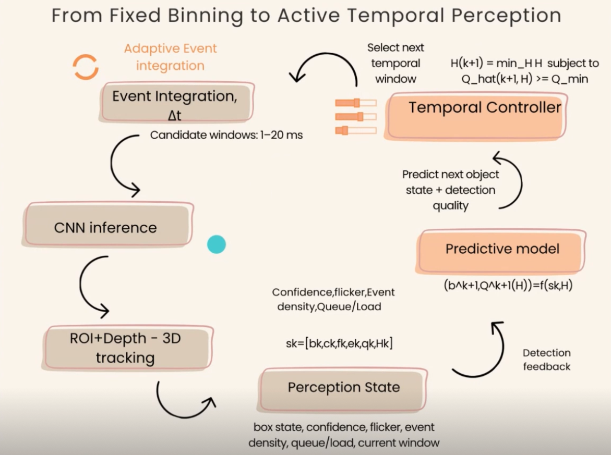
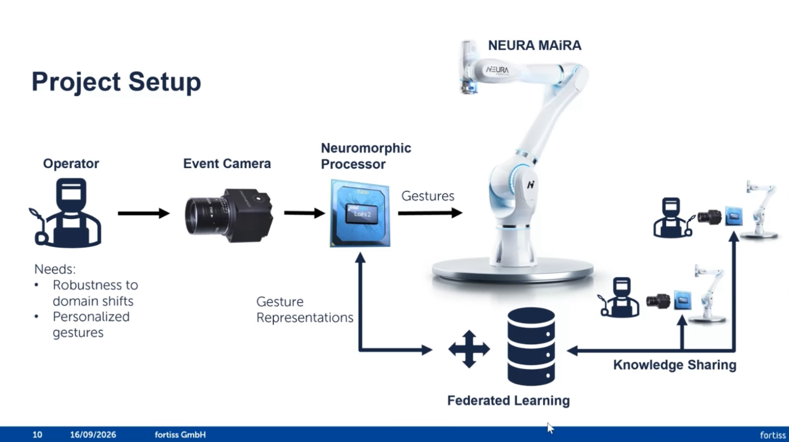
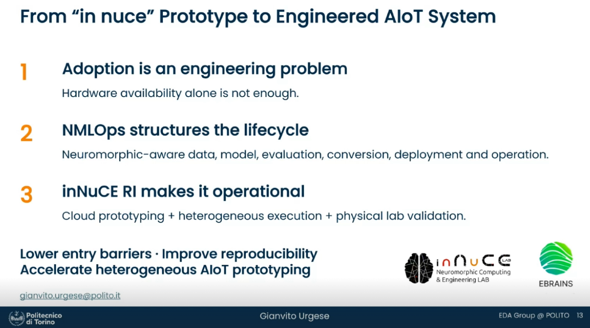
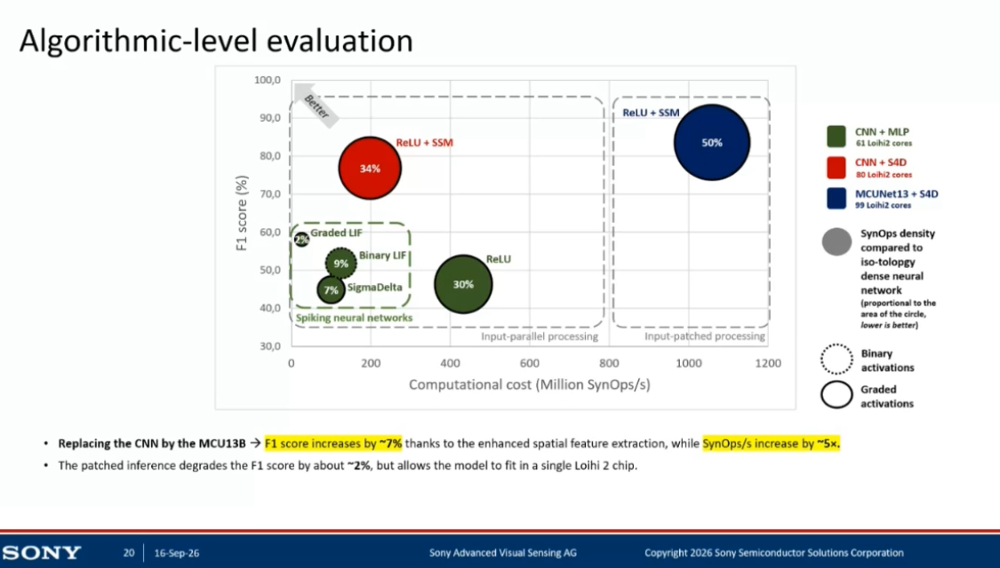
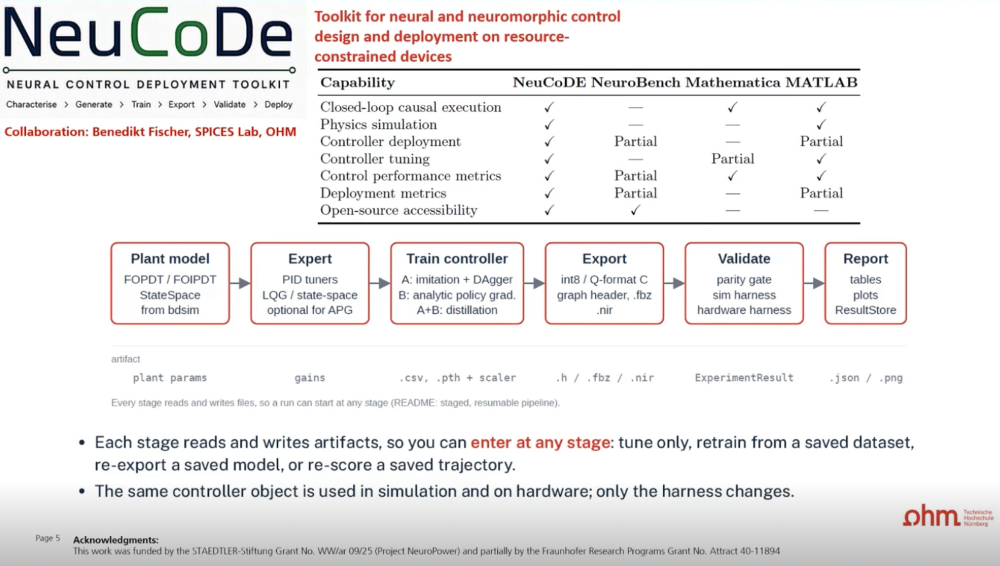
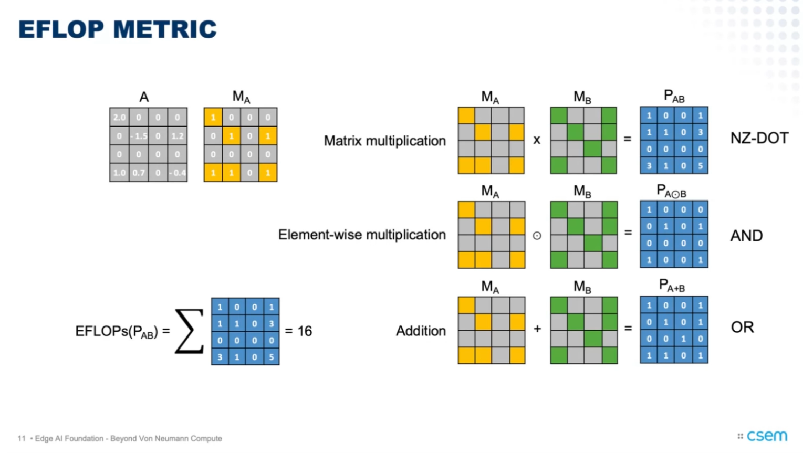
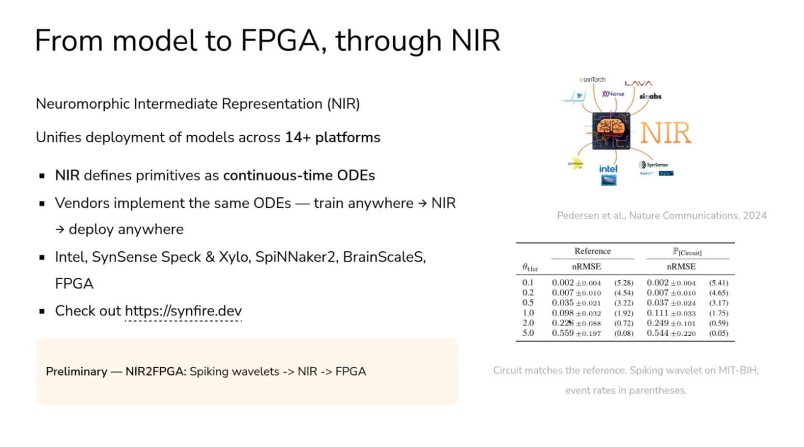

> 活动：*EDGE AI Neuromorphic Livestreams V2: Beyond von Neumann Compute — Neuromorphic AI at the Edge* 
> 日期：2026 年 9 月 16 日 
> 主办：EDGE AI Foundation / Neuromorphic Working Group 

## 摘要

报告围绕一个共同问题展开：**如何把事件驱动感知、稀疏计算和神经形态硬件，从研究概念推进为可部署、可评估且可信赖的边缘智能系统？** 七场报告依次覆盖自适应时间积分、持续与联邦学习、神经形态 MLOps、隐私保护跌倒检测、实时闭环控制、稀疏计算成本度量，以及具有信号处理保证的原生事件流水线。它们共同构成如下技术链：

> **异步传感 → 时间组织 → 稀疏／状态模型 → 异构硬件映射 → 系统级测量 → 可靠性与部署治理**

这些报告传递出的共同判断是：神经形态计算的价值不来自“SNN”标签本身，而取决于稀疏性是否贯穿传感、算法、数据搬运与硬件执行的完整链路。

## 七场报告概览

| # | 报告 | 主要问题 | 关键词 |
|---:|---|---|---|
| 1 | Adaptive Closed-Loop Control of Temporal Integration in Event-Based Embedded Perception | 事件应积累多长时间再推理？ | 自适应时间窗、事件视觉、闭环感知 |
| 2 | Continual and Federated Learning for Neuromorphic Human–Robot Interaction in Industrial Welding | 机器人怎样在线学习并跨设备共享知识？ | 持续学习、联邦学习、Loihi 2 |
| 3 | The inNuCE RI for Neuromorphic AIoT Apps Prototyping | 如何让碎片化硬件形成可复现实验流程？ | NMLOps、研究基础设施、异构部署 |
| 4 | Privacy-Preserving Fall Detection at the Edge Using Sony IMX636 and Intel Loihi 2 | 如何在单芯片上平衡准确率、稀疏性和隐私？ | 事件相机、graded LIF、S4D、patched inference |
| 5 | Neural Networks for Low-Latency, High-Reliability Control in Power Conversion Systems | 神经网络如何安全进入实时闭环控制？ | 行为克隆、混合控制、WCET、硬件验证 |
| 6 | EFLOP: A Sparsity-Aware Metric for Computational Cost | 如何公平比较 ANN 与 SNN 的有效计算量？ | 非零运算、稀疏训练、Pareto 前沿 |
| 7 | Frames without Frames | 不重建帧，如何仍然获得数学与部署保证？ | 协变性、连续时间动力学、NIR、FPGA |

## 1. 把“时间窗口”变成感知系统的控制变量

第一场报告针对事件视觉中的固定时间分箱问题。事件相机提供异步事件，但常见流水线仍把事件积累为固定长度的张量后再输入 CNN。固定窗口存在结构性矛盾：窗口过短时证据不足，窗口过长时信息过时并产生时间拖影；因此同一个窗口难以同时适应不同运动速度。

报告把下一次事件积分窗口写成由当前感知状态决定的控制动作：

$$
H_{k+1}=\pi(s_k),
$$

其中，状态 $s_k$ 可包含目标位置、检测置信度、闪烁、事件密度、计算负载和当前窗口。控制器在 $1\text{--}20\,\mathrm{ms}$ 的候选范围内选择尽可能短、同时又满足预测检测质量约束的窗口。

*图 1　自适应时间积分闭环：检测状态反馈给预测模型和时间控制器，下一时间窗不再是固定超参数。来源：第一场报告幻灯片。*

幻灯片显示，相比固定 $10\,\mathrm{ms}$ 窗口，自适应控制器在稳态速度和速度切换条件下均提高了检测率；平均推理延迟由约 $5.5\,\mathrm{ms}$ 降至 $4.8\,\mathrm{ms}$，端到端感知延迟由约 $25.9\,\mathrm{ms}$ 降至 $18.6\,\mathrm{ms}$。更值得注意的是，检测器本身没有改变，收益主要来自输入时间组织方式的改变。

**局限。** 当前证据主要来自传送带感知实验；完整机器人抓取闭环、未见速度分布以及预测器失配时的安全退化仍需验证。

## 2. 从静态推理走向持续学习的工业机器人

Michael Neumeier（fortiss / Technische Universität Chemnitz）介绍了 CORINNE 项目：事件相机采集操作者手势，SNN 在 Loihi 2 上完成识别，机器人再依据手势执行工业焊接任务。系统不仅要识别预训练手势，还要在部署期间增加新手势、适应不同操作者，并避免灾难性遗忘。

*图 2　CORINNE 原型链路：操作者、事件相机、神经形态处理器和 MAiRA 机器人构成本地闭环；不同机器人通过联邦机制共享知识表示。来源：Michael Neumeier 报告幻灯片。*

其基本架构是：先离线训练 Spiking CNN 作为特征提取器，再由较小的 CLP-SNN 在线吸收新类别；多个机器人交换原型或高层知识，而非上传原始事件数据。幻灯片报告的类别增量结果为：CLP 准确率约 $70.9\%$，接近完整重训练的 $72.2\%$，高于固定模型的 $43.7\%$ 和直接微调的 $36.1\%$。半监督策略可把更新需求最多减少约 $50\%$。

嵌入式比较中，Loihi 2 的基础推理延迟约 $5.8\,\mathrm{ms}$，Orin 约 $4.3\,\mathrm{ms}$；但相应能量约为 $0.8\,\mathrm{mJ}$ 与 $5.5\,\mathrm{mJ}$。这说明平台选择不是单纯比较最低延迟：Orin 具有成熟的软件生态和较低延迟，Loihi 2 则更适合长期在线、能源受限的适应性系统。

**局限。** 报告展示的是事件手势识别、持续／联邦学习实验和嵌入式原型，并未证明完整焊接闭环已达到生产级安全性；联邦原型交换也不等价于形式化隐私保护或安全聚合。

## 3. inNuCE：把神经形态原型开发变成可复现工程

Gianvito Urgese（Politecnico di Torino / inNuCE Lab）把神经形态技术的采用障碍定义为工程问题：硬件异构、SDK 与编程模型碎片化、工具链不成熟、设备不易获得，以及实验配置缺乏完整记录。为此，报告提出 NMLOps，即把 MLOps 扩展到事件传感、SNN 转换、异构硬件执行和物理实验验证。

*图 3　inNuCE 的三层论证：采用障碍是工程问题，NMLOps 组织生命周期，inNuCE RI 通过云端原型、异构执行和物理实验室使其可操作化。来源：Gianvito Urgese 报告幻灯片。*

inNuCE RI 由云端异构原型平台和实体实验室组成，通过容器化工具链、版本化工件、作业队列及统一入口连接神经形态芯片、FPGA、GPU、MCU 和真实传感器。展示的任务涵盖人体活动识别、盲文读取、事件手势、导航／追踪和约束满足。

这场报告的关键贡献不是宣称所有硬件具有相同语义，而是统一**生命周期和实验治理**：同一任务的模型、数据、编译版本、硬件目标、日志和测量结果能够被保存并重新执行。相关工作已形成 inNuCE RI 与 NMLOps 的正式论文（Urgese et al., 2026）。

**局限。** 工作流统一并不会自动消除不同芯片在神经元模型、数值精度、异步语义和测量方法上的差异；跨平台“可运行”也不必然意味着数值或时间行为等价。

## 4. IMX636 + Loihi 2：端侧跌倒检测的准确率—成本前沿

Sony 与 Intel 团队展示了从 Sony IMX636 事件传感器、MAX 10 FPGA 接口到单颗 Loihi 2 的完整跌倒检测链路。事件先在 FPGA 上完成空间映射、时间步组织和流量控制，再以稀疏脉冲输入 Loihi 2，从而避免在主机侧反复构造和搬运稠密事件帧。

*图 4　算法级 Pareto 比较。圆面积表示相对稠密同拓扑网络的 SynOps 密度；虚线和实线圆环分别表示 binary 与 graded activation。来源：Khacef 等报告幻灯片。*

报告给出了三个代表性工作点：

| 模型 | 报告的 $F_1$ | 计算特征 | 系统含义 |
|---|---:|---|---|
| graded-LIF CNN + MLP | 约 $60\%$ | 最低 SynOps | 适合极端算力／功耗约束 |
| CNN + S4D | 约 $77\%$ | 中等计算量 | 准确率与延迟的折中 |
| MCUNet13B + S4D | 约 $84\%\text{--}85\%$ | 最高计算量 | 追求检测准确率 |

MCUNet 原始规模预计需要约 $10$ 颗 Loihi 2。团队把 $160\times160$ 输入划分为 $25$ 个 $40\times40$ patch，顺序复用同一组核心，再重建输出特征图，使模型能装入单颗芯片，代价是约 $2$ 个百分点的 $F_1$ 损失。系统级测量中，三种模型的输入到输出延迟约为 $2\,\mathrm{ms}$、$2\,\mathrm{ms}$ 和 $40\,\mathrm{ms}$；Loihi 2 芯片功耗约为 $46.3\,\mathrm{mW}$、$77.5\,\mathrm{mW}$ 和 $88.9\,\mathrm{mW}$。

这项工作同时暴露了两个重要边界。第一，SynOps 增长不一定同比转化为功耗增长，因为当前研究芯片的静态功耗占比较高。第二，端侧推理是隐私保护的必要条件，却不是充分条件；若告警后仍上传事件片段，还需要片上匿名化、最小化上传和访问控制。论文版本见 Khacef et al. (2026)。

## 5. 神经网络进入安全关键闭环控制

Cristian Axenie（Technische Hochschule Nürnberg / Fraunhofer IIS）讨论了神经网络在功率变换、电机和执行器控制中的应用。标准反馈链为参考信号 $r$、误差 $e$、控制量 $u$、系统响应 $y$ 与测量响应 $y_m$。在这类系统中，模型平均误差远远不够；控制器还必须满足最坏执行时间（WCET）、抖动、稳定性、约束违反和故障回退要求。

*图 5　NeuCoDE 将对象建模、专家控制器、神经控制器训练、定点导出、仿真／硬件验证和报告组织成可恢复的工件流水线。来源：Cristian Axenie 报告幻灯片。*

报告提出逐步扩大控制权限的路线：

1. **控制器复制／行为克隆**：神经网络在 shadow mode 中模仿专家控制器，不直接驱动功率开关；
2. **混合神经控制器**：网络调节参数或补偿传统控制器；
3. **独立神经控制器**：只有在闭环性能、时序和故障验证通过后，才考虑让网络独立控制系统。

NeuCoDE 工具链覆盖对象模型、PID/LQG 专家、模仿学习与 DAgger、策略梯度、蒸馏、定点 C／NIR 导出、仿真与硬件 parity gate 以及结果报告。展示案例包括 $1\,\mathrm{kHz}$ 云台、电液阀执行器，以及具有 $27$ 个 H 桥单元、$57$ 路模拟测量和 $58$ 路光纤输出的模块化多电平矩阵变换器。

**局限。** 该工作明确标注为 WIP。对于安全关键控制，仍需报告最坏延迟、deadline miss、非法开关状态、峰值电流／电压、谐波、传感器故障与安全回退，而不能只使用平均模仿误差评价。

## 6. EFLOP：为稀疏 ANN 与 SNN 建立共同计算尺度

Simon Narduzzi（CSEM）指出，传统 FLOPs/MACs 假设网络稠密，而 firing rate 或 SynOps 又常忽略权重稀疏、状态更新、leak、reset、gating 和循环连接。因此它们很难在 ANN、SNN 与混合时序模型之间提供公平比较。

EFLOP 首先把数值张量转换为非零掩码，例如

$$
M_A=\mathbb{1}[A\ne 0],
$$

随后根据矩阵乘法、逐元素乘法和加法的掩码传播规则，统计真正由非零操作数触发的算术操作。

*图 6　EFLOP 的基本构造：矩阵乘法使用非零点积（NZ-DOT），逐元素乘法对应掩码 AND，加法对应掩码 OR。示例矩阵乘法得到 $16$ 个有效操作。来源：Simon Narduzzi 报告幻灯片。*

在 SHD 与 SSC 数据集上，报告比较了 DNN、IAF、LIF、RLIF 和 GRU。主要观察是：SNN 并不天然更便宜，过细时间分辨率和复杂神经元状态可能显著增加成本；稀疏感知训练则能把模型推向更优的准确率—EFLOP Pareto 前沿。论文进一步报告，在 $80\%$ 权重稀疏度且不牺牲准确率的条件下，GRU 与 LIF 的 EFLOP 最多分别降低约 $8.9\times$ 与 $3.6\times$（Narduzzi et al., 2025）。

**局限。** EFLOP 是部署前的硬件无关计算指标，不是焦耳指标；它不覆盖内存访问、数据搬运、静态功耗和具体映射效率，当前定义也主要针对同步离散时间模型。

## 7. Frames without Frames：为原生事件流水线补上理论保证

Jens Egholm Pedersen（DTU Electro）从更基础的问题出发：事件传感器已经具有微秒级时间分辨率、约 $120\,\mathrm{dB}$ 动态范围和异步输出，但消费这些事件的流水线往往仍靠经验选滤波器，并最终积累成帧交给 GPU，重新引入等待、冗余和数据搬运。

报告提出两个互补方向。其一是构造对空间与时间尺度变化具有**协变性**的时空感受野。若变换为 $g$、特征算子为 $\phi$，协变意味着

$$
g\cdot\phi=\phi'\cdot g',
$$

即物体运动或尺度变化时，特征以可预测方式变化，而不是简单丢弃变化信息。Pedersen、Conradt 与 Lindeberg（2025）证明了基于空间仿射高斯核以及时间 LI/LIF 动力学的时空感受野可以获得相应协变性质，并可作为事件网络的结构先验。

其二是通过 Neuromorphic Intermediate Representation（NIR）实现跨后端部署。NIR 以连续时间 ODE 原语表达神经动力学，让不同软件和硬件后端实现同一组语义，而不是交换某一厂商的专用模型格式。

*图 7　模型通过 NIR 部署到 FPGA／神经形态平台。右下实验比较参考实现和电路实现的误差，强调部署后的语义一致性检查。来源：Jens Egholm Pedersen 报告幻灯片。*

NIR 工作已在多个模拟器和数字神经形态平台上验证了 LIF、卷积 SNN 与循环 SNN 图（Pedersen et al., 2024）。报告中的初步 NIR2FPGA 结果进一步表明，事件阈值可以在近似误差与事件率之间形成可测量的权衡。

**局限。** “跨平台表示”不等于所有平台的数值与时间行为完全相同。真实部署仍需要 reference–chip parity test、峰值事件率测试，以及噪声、事件丢失、拥塞、阈值漂移和长时间运行稳定性验证。

## 参考文献与延伸阅读

1. EDGE AI Foundation. (2026). [*EDGE AI Neuromorphic Livestreams V2: Beyond von Neumann Compute — Neuromorphic AI at the Edge*](https://www.edgeaifoundation.org/livestreams/edge-ai-neuromorphic-livestreams-v2-beyond-von-neumann-compute-neuromorphic-ai-at-the-edge). 直播活动页面，访问于 2026-09-17。
2. fortiss. (2024–2026). [*CORINNE: Collaborative welding robots with human interaction over gestures*](https://www.fortiss.org/en/research/projects/detail/corinne). 项目页面，访问于 2026-09-17。
3. Urgese, G., Fra, V., Pignata, A., et al. (2026). The inNuCE Research Infrastructure and the Neuromorphic MLOps for AIoT prototyping. *IEEE Internet of Things Journal, 13*(9), 19286–19299. [https://doi.org/10.1109/JIOT.2026.3663902](https://doi.org/10.1109/JIOT.2026.3663902)
4. Khacef, L., Weidel, P., Hogyoku, S., et al. (2026). Privacy-Preserving Fall Detection at the Edge Using Sony IMX636 Event-Based Vision Sensor and Intel Loihi 2 Neuromorphic Processor. In *NICE 2026*. [https://doi.org/10.1109/NICE69539.2026.11567444](https://doi.org/10.1109/NICE69539.2026.11567444)
5. Narduzzi, S., Zenke, F., Liu, S.-C., & Dunbar, L. A. (2025). EFLOP: A sparsity-aware metric for evaluating computational cost in spiking and non-spiking neural networks. *Neuromorphic Computing and Engineering, 5*(3), 034011. [https://doi.org/10.1088/2634-4386/addee8](https://doi.org/10.1088/2634-4386/addee8)
6. Pedersen, J. E., Abreu, S., Jobst, M., et al. (2024). Neuromorphic intermediate representation: A unified instruction set for interoperable brain-inspired computing. *Nature Communications, 15*, 8122. [https://doi.org/10.1038/s41467-024-52259-9](https://doi.org/10.1038/s41467-024-52259-9)
7. Pedersen, J. E., Conradt, J., & Lindeberg, T. (2025). Covariant spatio-temporal receptive fields for spiking neural networks. *Nature Communications, 16*, 8231. [https://doi.org/10.1038/s41467-025-63493-0](https://doi.org/10.1038/s41467-025-63493-0)
