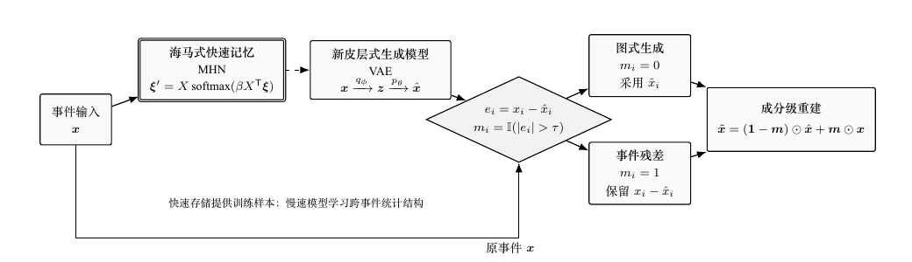
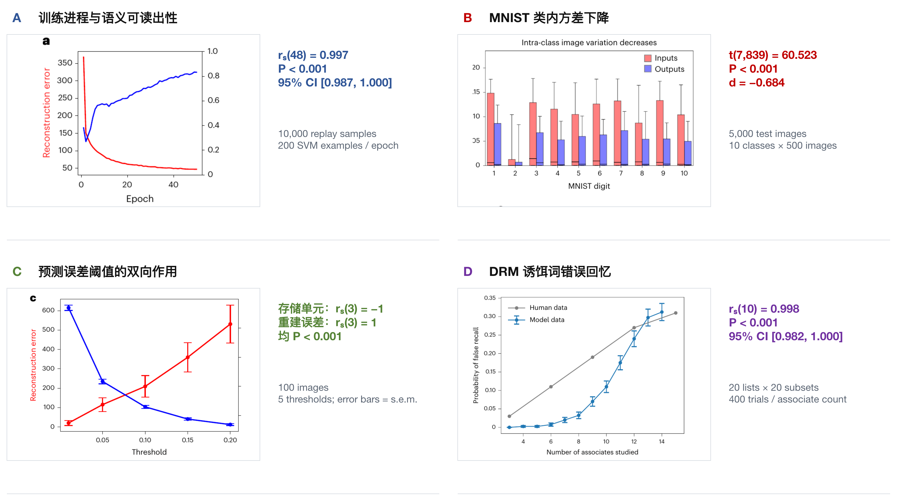
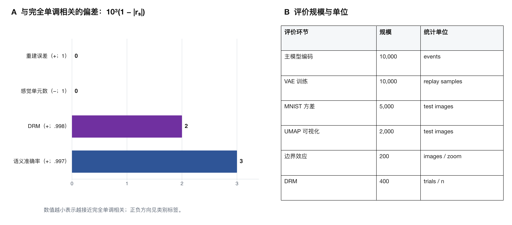

> 本文基于 E. Spens 与 N. Burgess 的论文 [*A Generative Model of Memory Construction and Consolidation*](https://doi.org/10.1038/s41562-023-01799-z)，发表于 *Nature Human Behaviour*，第 8 卷，526–543 页，2024 年。

## 摘要

Spens 和 Burgess 将系统巩固表述为快速事件记忆对慢速生成模型的离线训练，并以预测误差决定哪些感觉细节需要单独保留。本文先分析现代 Hopfield 网络、变分自编码器和预测误差门控之间的系统级耦合，再按样本规模、模型参数和统计量复核原论文结果。

该模型在既定仿真条件下产生语义可读出、原型化、选择性细节存储和 DRM 诱饵词回忆。前者构成对架构与原理的学习复述，后者是基于原文数据的进一步定量分析；二者均不构成对真实神经实现的直接验证。

## 1. 问题与证据范围

论文研究的问题是：一次经历形成的事件痕迹，如何在离线回放后转化为可概括的知识，同时保留不能由既有图式预测的细节？模型以现代 Hopfield 网络（modern Hopfield network, MHN）表示快速事件记忆，以变分自编码器（variational autoencoder, VAE）表示慢速生成学习，并用预测误差控制感觉细节的保存。

本文分析分为两个层次：首先分析论文的系统架构与计算原理，随后以原文样本规模、模型参数和统计量检验这些机制是否产生预期现象。所有数值均来自原论文正文、方法和图注。下文据此区分计算假设、原文报告的统计结果和仍待验证的神经解释。

## 2. 系统架构与工作原理

### 系统级创新

MHN 和 VAE 均为已有算法。这里的主要创新不在于提出新的单一网络，而在于将三个计算环节组织成闭环：

1. **快速编码与离线回放。** MHN 对单次事件快速编码，并在离线阶段产生回放样本；VAE 以这些样本为训练数据，逐步学习跨事件的概率结构。
2. **语义读出与感觉生成。** VAE 潜变量既可供语义分类器直接读出，也可经解码器生成感觉层面的重建。
3. **预测误差门控。** 重建误差作为门控信号，使可预测成分由生成模型承担，而不可预测的细节继续保存在事件痕迹中。

这一结构改变的不是完整记忆在两个存储器之间的位置，而是回忆时不同成分的来源。随着生成模型改善，图式一致成分可由慢速系统生成；超出图式预测的残差仍依赖快速事件记忆。因此，巩固被表述为生成分布的学习和记忆表征的重新分工，而非事件副本的整体搬运。

*图 1　回放驱动的生成学习与预测误差门控。MHN 对事件进行快速编码并向 VAE 提供离线回放；VAE 形成生成预测。逐元素误差经阈值分为图式生成与事件残差两条通路，并在提取时完成成分级重建。*

### 回放驱动的生成学习

MHN 的状态更新可写为

$$
\boldsymbol{\xi}_{\mathrm{new}}
=
X\,\operatorname{softmax}
\left(\beta X^{\mathsf T}\boldsymbol{\xi}\right),
$$

其中，$X$ 为存储模式矩阵，$\boldsymbol{\xi}$ 为查询状态，主模拟取逆温度 $\beta=20$。相似度加权使不完整查询收敛至已存事件附近，从而提供内容寻址和模式补全。模型将 MHN 生成的回放视作离线训练集；快速系统承担样本保持，慢速系统承担分布估计，二者分别对应一次学习与跨样本统计提取。

从 MHN 回放的样本训练 VAE，其目标函数为

$$
\mathcal{L}(x)=
\mathbb{E}_{q_{\phi}(z\mid x)}
[-\log p_{\theta}(x\mid z)]
+
D_{\mathrm{KL}}
\left(q_{\phi}(z\mid x)\,\|\,p(z)\right).
$$

第一项约束感觉重建，第二项使后验 $q_{\phi}(z\mid x)$ 接近先验 $p(z)$。当回放样本具有稳定的类别结构时，潜变量 $z$ 可压缩共同变化，并支持语义读出；解码器 $p_{\theta}(x\mid z)$ 则根据该压缩表示生成典型样本。由此产生的原型化不是额外规则，而是有损生成学习的直接结果。

### 预测误差门控与重建

扩展模型仅保存超过阈值的重建误差：

$$
d_i=(x_i-\hat{x}_i)
\mathbb{I}\!\left(\lvert x_i-\hat{x}_i\rvert>\tau\right),
$$

其中，$\tau$ 为预测误差阈值。定义掩码 $m_i=\mathbb{I}(\lvert x_i-\hat{x}_i\rvert>\tau)$，则提取过程可等价写为

$$
\tilde{\boldsymbol{x}}
=
(\boldsymbol{1}-\boldsymbol{m})\odot\hat{\boldsymbol{x}}
+
\boldsymbol{m}\odot\boldsymbol{x}.
$$

即低误差位置采用生成模型的预测，高误差位置用原事件细节覆盖。这个表达是对论文门控机制的代数化重述，不是额外拟合的模型。

阈值 $\tau$ 决定压缩与失真的权衡：增大 $\tau$ 会减少残差存储，但允许更多生成误差进入最终重建。该机制可从率–失真角度理解为在存储量 $\lVert\boldsymbol{d}\rVert_0$ 与重建误差之间选择工作点；原论文只比较五个固定阈值，并未求解全局最优的率–失真目标。因此，这一解释说明了可检验的权衡，不应写成模型已经找到最优编码。

### 与系统巩固理论的关系

互补学习系统理论强调海马的快速学习与新皮层的慢速统计学习；多重痕迹理论则强调情景记忆的生动细节可持续依赖海马复合体。本模型把两类主张落实到同一次重建的不同成分：图式一致的概念结构可由生成模型逐步承担，不可预测的事件细节仍由海马式残差补足。

这一对应关系解释了模型为何能够同时表现出语义抽取与情景细节依赖，但它仍是功能层面的计算映射，不能单凭仿真确定具体脑区或突触机制。

## 3. 实验设置

*图 2　主模拟的训练与评价流程。图中数值来自原论文，流程为本报告整理。*

| 模块或任务 | 参数 | 数值 |
|---|---|---:|
| MHN | 编码事件数 | $10{,}000$ |
| MHN | 逆温度 | $\beta=20$ |
| VAE | 回放样本数 | $10{,}000$ |
| VAE | 潜变量维数 | $20$ |
| VAE | 训练设置 | $\leq 50$ epochs；$10^{-3}$ |
| VAE | KL 权重 | $1$ |
| 语义读出 | SVM 样本数 | $200$/epoch |
| DRM | 词表与潜变量 | $4{,}206$，$300$ |
| DRM | 回忆阈值 | $>0.5$ |

VAE 使用平均绝对误差作为重构损失，并采用 AMSGrad 与早停；这些设置用于检验机制能否产生目标现象，论文未将其作为优化后的最优架构。

## 4. 定量结果

*图 3　四组主要结果。图版裁剪自原论文图 3a、4b、5c 和 7b；右侧统计量与样本规模按原文重排，误差线定义沿用原论文。*

| 评价量 | 样本或评估规模 | 原文统计量 | 直接支持的结论 |
|---|---|---|---|
| 语义分类准确率 | $10{,}000$ 个回放样本；每 epoch $200$ 个 SVM 样本 | $r_s(48)=0.997$，$P<0.001$，$95\%$ CI $[0.987,1.000]$ | 潜变量中的类别信息随训练单调增加。 |
| MNIST 类内像素方差 | $5{,}000$ 张测试图像；$10\times500$；$7{,}840$ 个配对方差 | $t(7839)=60.523$，$P<0.001$，$d=-0.684$；配对差 $95\%$ CI $[0.021,0.022]$ | 在该设置下，VAE 重建降低类内方差，产生原型化。 |
| 阈值与存储量、误差 | $100$ 张图像；$\tau\in\{0,0.05,0.10,0.15,0.20\}$ | 存储单元数 $r_s(3)=-1$；重建误差 $r_s(3)=1$；均 $P<0.001$ | 提高 $\tau$ 同时减少感觉存储并增加重建误差。 |
| 边界效应 | 缩放范围 $80\%$–$120\%$；每一缩放水平 $200$ 张图像 | 原文报告重建向训练分布的典型视角偏移 | 生成重建可同时产生边界扩展和边界收缩方向。 |
| DRM 诱饵词回忆 | $20$ 个列表 $\times$ $20$ 个子集；每一联想词数量 $400$ 次试验 | $r_s(10)=0.998$，$P<0.001$，$95\%$ CI $[0.982,1.000]$ | 模型曲线与人类数据随列表长度的单调趋势高度一致。 |

语义读出的强相关表明 VAE 潜变量逐步包含可线性读取的类别信息，但不等于潜变量已经覆盖人类语义记忆的全部结构。MNIST 的配对检验给出中等偏大的标准化效应，符号 $d=-0.684$ 取决于论文的差值方向；其实体含义是输出方差低于输入方差。预测误差实验在五个阈值上得到完全单调的秩相关，因此可确定方向，不能据此估计更细粒度的非线性函数。

*图 4　相关系数与评价规模的汇总。A 将原文报告的 Spearman 相关系数转换为 $10^3(1-\lvert r_s\rvert)$，数值越小表示越接近完全单调相关；B 列出各评价环节的样本规模与统计单位。*

图 4A 的转换不产生新的统计证据，只用于分辨 $\lvert r_s\rvert=0.997$、$0.998$ 与 $1.000$ 的数值差异。它不能与表中的 $t$ 统计量或 Cohen's $d$ 直接比较，也不能据此对不同任务的证据强弱排序。DRM 结果说明曲线趋势接近，但论文没有据此排除其他产生错误回忆的认知机制。

## 5. 解释边界

现有实验主要使用 Shapes3D、MNIST 和词袋形式的 DRM 数据。它们分别提供可控制的视觉生成因素、手写数字类内变化和语义联想结构，适合验证模型能否复现目标现象，但不足以估计自然情景记忆中的时序、情境和多模态复杂度。

模块与脑区的对应关系同样应保持功能层面的表述。MHN 说明内容寻址和模式补全可以承担海马侧功能，VAE 说明生成学习可以承担跨事件统计提取；标准 VAE 的全局反向传播并不等同于已知局部突触更新规则。预测误差阈值也首先是算法变量，而非已测得的神经阈值。脑区映射和学习规则仍需独立的神经数据或模型比较验证。

## 6. 可进一步检验的问题

后续可能的工作可围绕两个可量化问题展开：

1. 在固定存储预算 $B$ 下，比较固定阈值与自适应阈值，使重建误差 $\operatorname{MAE}(\boldsymbol{x},\hat{\boldsymbol{x}})$ 与保存单元数 $\lVert\boldsymbol{d}\rVert_0$ 形成可复现的 Pareto 曲线。
2. 将静态输入扩展为序列，分别报告事件顺序准确率、长时延检索误差和回放次数。

## 7. 结论

该论文的架构创新概括为三个耦合关系：MHN 回放为 VAE 提供离线训练样本，VAE 同时支持语义读出与感觉生成，预测误差门控则在图式生成和事件残差之间分配重建成分。在这一原理框架下，原论文的定量结果进一步表明：训练过程中语义可读出性提高，生成重建呈现原型化，存储量与重建误差随阈值反向变化，DRM 诱饵词回忆趋势接近人类数据。

因此，可以得到结论：该架构为记忆巩固提供了统一且可运行的计算解释，并把互补学习与持续的情景细节依赖落实到成分级重建过程。现有证据证明的是特定模型在给定数据和参数下的现象复现；对真实神经机制、跨数据集稳健性和长期序列学习的判断仍需新的数据与对照实验。

## 参考文献

1. Spens, E., & Burgess, N. (2024). A generative model of memory construction and consolidation. *Nature Human Behaviour, 8*, 526–543. [https://doi.org/10.1038/s41562-023-01799-z](https://doi.org/10.1038/s41562-023-01799-z)
2. McClelland, J. L., McNaughton, B. L., & O'Reilly, R. C. (1995). Why there are complementary learning systems in the hippocampus and neocortex. *Psychological Review, 102*(3), 419–457.
3. Nadel, L., & Moscovitch, M. (1997). Memory consolidation, retrograde amnesia and the hippocampal complex. *Current Opinion in Neurobiology, 7*(2), 217–227.
4. Ramsauer, H., et al. (2021). Hopfield networks is all you need. In *Proceedings of the International Conference on Learning Representations*.
5. Kingma, D. P., & Welling, M. (2014). Auto-encoding variational Bayes. In *Proceedings of the International Conference on Learning Representations*.
